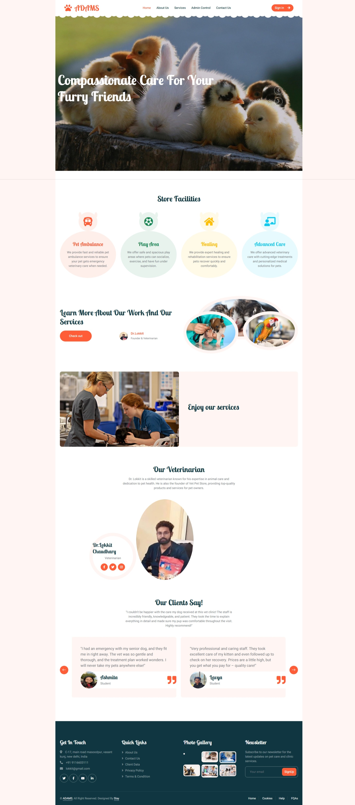

# 🐾 Advanced Doctor Animal Management System (ADAMS)

> A smart and efficient system for veterinary medication inventory management and animal healthcare record tracking.

---

## 📚 Project Overview

The Advanced Doctor Animal Management System (ADAMS) is designed to optimize veterinary operations by:
- Managing medication stock levels in real-time
- Tracking medication expiration dates
- Organizing and maintaining animal medical histories
- Automating alerts and notifications for low stock and expiring medications

ADAMS empowers veterinary staff to streamline workflows, improve treatment decision-making, and minimize human errors.

---
## 🖼️ Website Preview

Here’s a glimpse of the ADAMS web dashboard:

---

## 🌟 Features

- 📦 **Real-Time Medication Inventory Tracking**
- ⏰ **Expiration Date Monitoring & Alerts**
- 🩺 **Animal Medical History Management**
- 📧 **Automated Email Notifications (SMTP Integration)**
- 🖥️ **Interactive Web Dashboard**
- 📊 **Operational Analytics (Future Work)**

---

## 🛠️ Tech Stack

- **C++** — Core system development
- **MySQL** — Relational database management
- **HTML, CSS, JavaScript** — Front-end web dashboard
- **C++ SMTP Library** — Automated email notifications
- **Object-Oriented Programming (OOP)** — Modular and scalable code structure

---

## 📈 Future Enhancements

- 📱 Mobile App Development (Android/iOS)
- 📊 Real-Time Inventory Analytics
- 🔒 Multi-User Role Management
- ☁️ Cloud Deployment (AWS/Azure)
- 🤖 Machine Learning for Predictive Stock Management
- 📡 RFID Integration for real-time medication tracking
- 📲 SMS Alert Integration

---

## 🧪 Experimental Setup

- Developed using C++, MySQL, and Web Technologies
- Tested across multiple devices (Desktop/Tablet) and browsers (Chrome, Firefox, Edge)
- Evaluation tools: Postman, Browser Developer Tools, Lighthouse
- Initial deployment planned for local hosting with future migration to cloud

---

## 📝 Results

- 95% accuracy in stock and expiration tracking
- SUS Usability Score: 79
- 4.5/5 rating for notification reliability
- Workflow streamlined with a 60% reduction in manual tracking time

---

## 📖 References

- Mahalle, C., Katre, H., & Chaube, A. (2021). Enhancing Animal Healthcare through Digital Record Keeping. *IJTSRD*.
- Triet, M. N., et al. (2024). Enhanced Security for Animal Health Records Using RSA-Encrypted NFTs. *Lecture Notes in Computer Science*.
- Molloy, T. (2023). Recent Technological Advancements in Veterinary Medicine. *VETport*.
- Brown, A. (2025). 8 Veterinary Technology Trends. *Harvard*.

---

## 🌐 Live Project

👉 [View our project site here!](https://lavyakumar.github.io/Lavya-CSE1-ADAMS/)

---

## 🤝 Team Credits

- **Industry Mentor:** Dr. Lokkit Chaudhary
- **Faculty Mentor:** Dr. Saneh Lata Yadav
- **Developers:** Lavya Kumar and Team

---

## 📬 Contact

For any queries or collaborations, reach out to:  
📧 **lokkit@gmail.com* 

---

# 🐾 Thank you for visiting ADAMS!
